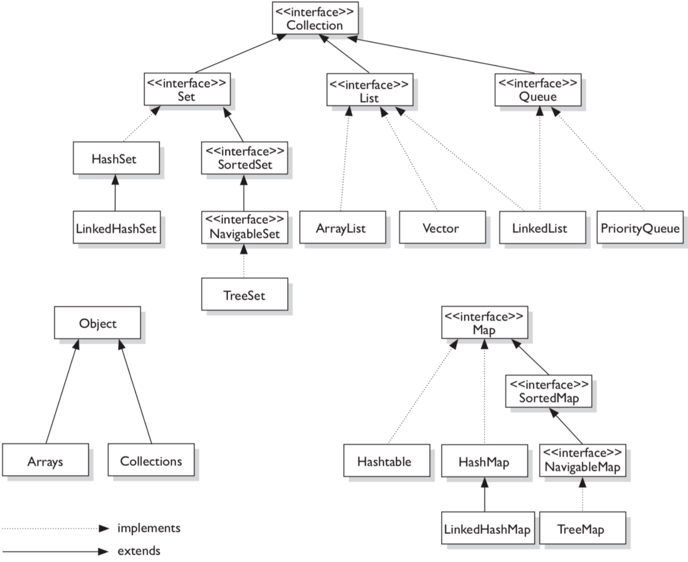
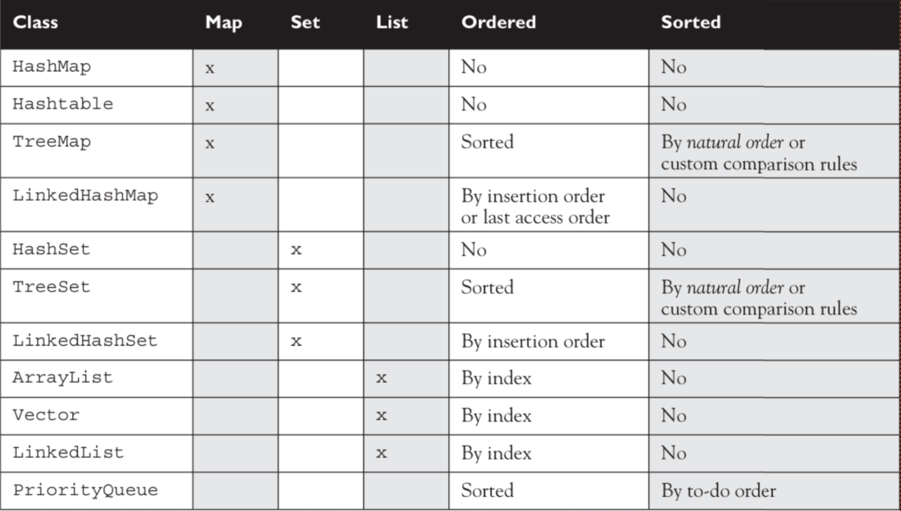
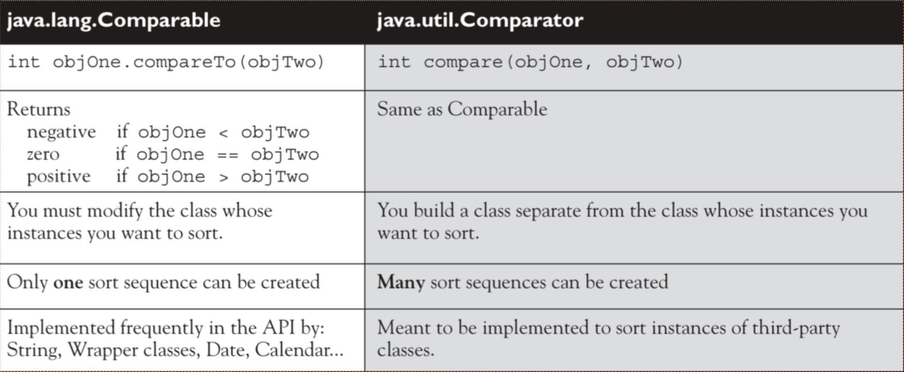

# Collection API

## Основные интерфейсы

Основные интерфейсы и их реализации, с которыми будет вестись работа с коллекциями:

| Map | Set | List | Queue | Utilities |
| --- | --- | ---- | ----- | --------- |
| HashMap | HashSet | ArrayList | PriorityQueue | Collections |
| Hashtable | LinkedHashSet | Vector | | Arrays |
| TreeMap | TreeSet | LinkedList | | |
| LinkedHashMap | | | | |

Map-ы не имеют отношение с интерфейсом Collection связь IS-A.

## Сортировка и упорядочивание

* Реализованные коллекции могут быть unsorted и unordered, ordered и unsorted, или sorted и ordered
* Сортировка - это частный случай упорядочивания, те если класс отсортирован, то он и упорядочен
* Ordered коллекция - это значит что через нее можно пройти в определенном порядке(не рандомно) 
* Sorted коллекция - это значит что последовательность элементов определена правилами. Сортировка происходит на основе атрибутов объекта

## List

* List работает с индексом.
* Все реализации List-а упорядочены по индексу 
* ArrayList - увеличиваемый массив. Он предоставляет быструю итерацию и рандомный доступ. Он должен быть в приоритете, если вам нужна быстрая итерация, но без большого количества вставок и удалений 
* Vector - синхронизированный ArrayList. Лучше не использовать, так как синхронизация бьет по производительности.
* LinkedList - двусвязный список. Итерация происходит медленнее, но вставка и удаление элементов происходит быстрее.

## Set

* Set работает с уникальными элементами. Сравнение двух элементов на уникальность происходит через equals. 
* HashSet - unsorted и unordered Set. Использует hashCode для вставки элементов. Используйте его, если вам не важно в каком порядке итерироваться по уникальным элементам. 
* LinkedHashSet - ordered версия HashSet, поддерживающая двусвязный список. 
* TreeSet - отсортированная коллекция. Использует красно-черное дерево. С помощью Comparable или Comparator можно задать свой порядок.

## Map

Map - это набор уникальных ключей и значений. Поиск значения происходит по ключу. 

* Метод equals определяет одинаковость двух ключей. 
* HashMap - unsorted и unordered коллекция. Ключи размещаются в мапе на основе hashCode ключа. Позволяет установить null в качестве ключа и в качестве значения. 
* Hashtable - синхронизированный аналог HashMap-ы. null-ы запрещены. 
* LinkedHashMap - ordered версия HashMap. Добавление и удаление медленнее, но итерация быстрее. 
* TreeMap - sorted Map-а, сортировку которой можно определить через Comparable или Comparator.

## Queue

Queue - ordered коллекция, работающая по принципу FIFO. LinkedList может работать как очередь. 

* PriorityQueue - очередь, работающая по принципу priority-in priority-out. Сортировка устанавливается за счет Comparable или Comparator.
* Вытаскивание элементов происходит исходя из приоритета
* Дефолтный приоритет - 1,2,3,4 и тд
* Custom-ный - исходя из Comparator-а

## Таблица ordered/sorted

## Comparable/Comparator

Comparable - интерфейс, позволяющий сортировать объекты класса. Для работы класса необходимо реализовать метод compareTo. 
При помощи реализации Comparable можно создать только одну реализацию сравнения объектов класса. Если хочется реализовать альтернативный способ сравнения для сортировки, то нужно создать класс, реализующий Comparator(метод compare). 

* compareTo и compare возвращают int, показывающий насколько один элемент отличается от другого.
* Во время сортировки пробел ставиться перед символами в верхнем регистре, а затем уже в нижнем регистре 

## Метод equals()

equals служит для сравнения двух объектов. Если не переопределить метод, то будет производиться сравнение по ссылкам. 
Тк в equals передается Object в качестве параметра, то сначала стоит проверить его через instanceof, а затем кастить к нужному классу. 

При переопределении equals нужно следовать следующим правилам: 

* рефлексивность — для любого значения x выражение вида x.equals(x) всегда должно возвращать true(когда при этом x != null)
* симметричность — для любых значений x и y выражение вида x.equals(y) должно возвращать true только в том случае, если y.equals(x) возвращает true
* транзитивность — для любых значений x, y и z, если выражение x.equals(y) возвращает true, при этом y.equals(z) тоже возвращает true, тогда и x.equals(z) должно вернуть значение true.
* согласованность — для любых значений x и y повторный вызов x.equals(y) будет всегда возвращать значение предыдущего вызова этого метода при условии, что поля, используемые для сравнения этих двух объектов, не были изменены между вызовами.
* сравнение null — для любого значения x при вызове x.equals(null) будет возвращено — false.

## Метод hashCode()

hashCode() – это метод класса Object, задача которого — генерирование некоторого числа, которое представляет конкретный объект. 

* Хорошая хеш-функция при подсчете должна опираться на элементы класса(поля). Поэтому в качестве ключа рекомендуется использовать иммутабельный объект. 
* Если использовать изменяемый объект, то можно потерять пару, так как сохранена она будет в бакете для первоначального хеш-кода, а после изменения – поиск будет производиться в другом бакете.
* При вычислении хеш-кода стоит использовать те же поля, что и при equals.

## Bucket

Bucket - набор элементов хеш-таблицы с близким значением хеш-функции. 

* Хеш‑функция может принимать большой диапазон значений. Из-за технических ограничений внутренний массив хеш‑таблицы может содержать меньшее количество элементов. Тогда элементы с близкими значениями хеша попадут в одну ячейку.
* При коллизии оба элемента попадают в один бакет хеш‑таблицы. Большое число коллизий приводит к замедлению работы хеш‑таблицы.

## Коллизии в hashCode

Коллизия в hashCode() – ситуация, в которой два разных объекта имеют одинаковое значение хеш-кода. 
Это может произойти из-за того, что тип, выделенный под хеш-код ограничен integer-ом. 
Также причиной повторяющего кода может стать плохо реализованная функция  генерации кода.

## Iterable и Iterator

Iterable – интерфейс, представляющий метод iterator, который, в свою очередь, позволяет вызвать объект Iterator для текущей коллекции.
Iterator - это объект предоставляющий возможность двигаться по коллекции и перебирать элементы, причем пользователю не нужно знать реализацию конкретной коллекции. 

* hasNext() — возвращает true, если есть элемент, расположенный после указателя
* next() — возвращает следующий элемент после указателя. Если такового не будет, выбрасывается NoSuchElementException. 
* remove() — удаляет из коллекции последний полученный элемент методом next(). Если же next() до вызова remove() не вызывали, будет брошено исключение — IllegalStateException
* forEachRemaining(<Consumer>) — выполняет переданное действие с каждым элементом коллекции

## ListIterator

ListIterator – класс, похожий на Iterator, только выполняющий проход в обе стороны.

* Используется в LinkedList
* add(<Element>) — вставляет новый элемент в список
* hasPrevious() — возвращает true, если есть элемент, расположенный перед указателем
* nextIndex() — возвращает индекс в списке следующего элемента после указателя
* previous() — возвращает предыдущий элемент
* previousIndex() — возвращает индекс предыдущего элемента
* set(<Element>) — заменяет последний элемент, возвращенный методами next() или previous().

## Arrays

Arrays – утилитный класс для работы с массивами.

* copyOf()/System.arraycopy() – копирует массив
* asList() - копирует массив в список. При дальнейшем изменении одного из объектов будет также меняться второй объект
* sort() – сортировка массива. Можно указать компаратор
* toString() – преобразование массива в строку
* deepEquals() – сравнение двумерных массивов
* deepToString() – вывод двумерных массивов
* copyOfRange() – копирование массива в определенном диапазоне
* binarySearch() - поиск элемента в массиве

## Collections

Collections – утилитный класс для работы с коллекциями.

* sort() - сортирует коллекцию
* binarySearch() - поиск элемента в коллекции
* reverse() – разворот последовательности элементов в коллекции
* shuffle() – перемешивание последовательности элементов в коллекции
* empty*Type*() – возвращает пустую коллекцию
* singleton*Type*() – возвращает коллекцию из одно элемента
