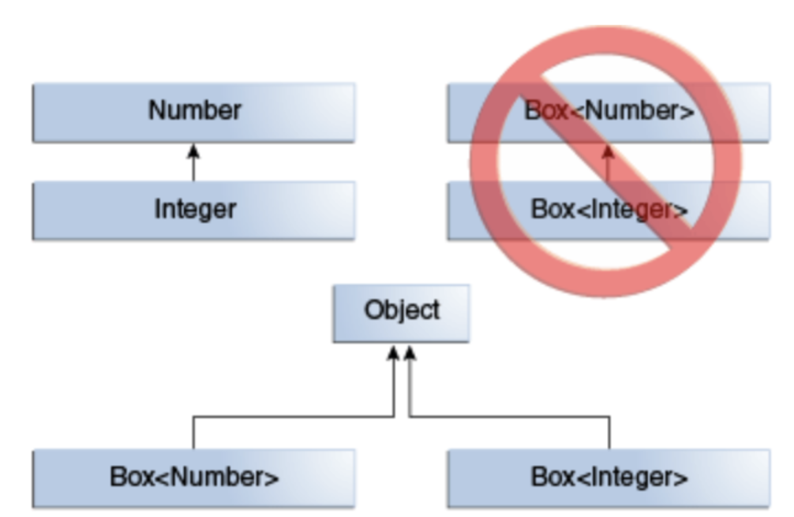
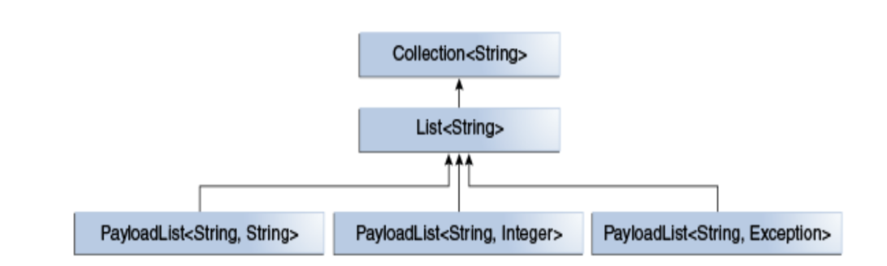
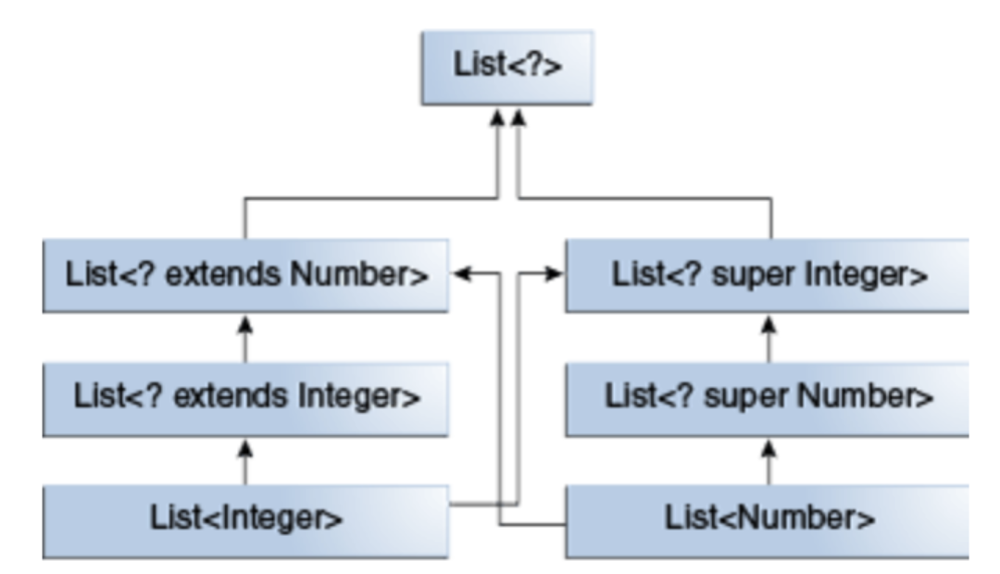

# Generics

## Wrappers

Wrapper – классы, представляющие классовое представление примитивов.
* % и += нельзя применять
Autoboxing и unboxing – автоматические переводы между примитивами и wrapper-ами при помощи Java компилятора
* Из wrapper-a в примитив при помощи метода *type*Value()

| primitive | wrapper   |
| --------- | --------- |
| boolean   | Boolean   |
| byte	    | Byte      |
| char	    | Character |
| float	    | Float	|
| int 	    | Integer	|
| long	    | Long	|
| short	    | Short	|
| double    | Double	|

## Введение

* Generic-и нужны для уменьшения количества багов за счет повышения реюзабельности, ужесточения проверки типов на этапе компиляции и избавления от class cast-ов. 
* Generic-и позволяют использовать типы как параметры классов, интерфейсов и методов.
* Вместо Generic-ов можно использовать Object, но из-за этого увеличивается шанс ошибок в runtime-е.

## Generic классы

* Синтаксис: class Name<T1, T2, ..., Tn> { /* ... */ }
* Типы в Generic-ах не могут быть примитивами.
* Типы должны называться одной заглавной буквой(по конвенции).

Не путать:
T в Foo<T> - параметр типа
String в Foo<String> - аргумент типа

## Создание объекта с Generic-ом

* List<Integer> integerList = new ArrayList<Integer>()
* List<Integer> integerList = new ArrayList<>() – The Diamond
* Pair<String, Integer> pair = new OrderedPair<String, Integer>("Even", 8)
* Pair<String, Box<Integer>> p = new OrderedPair<>("primes", new Box<Integer>(...))

## Generic методы

Generic методы – методы, у которых есть свои параметры типа. 

* Их тип ограничен телом метода. 
* Generic конструктор аналогичны generic методам(тип указывается после new).
* Список параметров типа должны быть перед типом результата.
* При вызове такого метода аргументы типа указываются перед именем метода (можно и не указывать – это называется type inference).

## Raw types

Raw type - имя для generic класса или интерфейса без аргумента типа.

Аргумент типа в данном случае будет Object.

Так как raw types встречаются в legacy коде, то рекомендуется запускать программу с -Xlint:unchecked, что позволит увидеть unchecked предупреждения.

## Bounded type parameter

Bounded type parameter – ограничение типов, которые могут быть использованы как параметр типа. Для ограничения типа необходимо добавиsть слово extends и тип после.
Множественное ограничение – ограничение несколькими классами.
```<T extends B1 & B2 & B3>```
Если наследование происходит от класса, то он должен быть первым в последовательности.

## Наследование у Generic-ов

* Если в классе параметр типа имеет наследников, то это не значит, что экземпляр этого класса с типом наследника является наследником этого же класса с типом родителя.



* С разными классами в параметре типа можно работать через родительский класс.


## Wildcards

Wildcard(?) - в generic коде представляет неизвестный тип. 
* Может быть типам параметра, поля, локальной переменной или возвращаемым типом.
* Не используется в типе аргумента метода, создании инстанса или супертипе.
* При помощи wildcard-ов можно создать связь между generic-ами
Можно wildcard не ограничивать и у этого есть несколько применений:
* Работать с типом как с Object.
* Можно выполнять функционал не завязанный на параметр типа.

## Ограничения wildcard

* Wildcard можно ограничить сверху при помощи extends, таким образом мы будем работать с родительским классом.
* Wildcard можно ограничить снизу при помощи super, таким образом мы будем работать с ним, как с Object.
* Wildcard можно ограничить либо сверху, либо снизу, но не одновременно.

## Иерархия wildcard-ов



## Wildcard capture

Wildcard capture – подстановка конкретного типа wildcard-у. 
Пример: ```void foo(List<?> i) { i.set(0, i.get(0)); }```
Ошибка метода: required: int,CAP#1 found: int,Object
Для решения данной ошибки достаточно создать helper метод:
```private <T> void fooHelper(List<T> l) { l.set(0, l.get(0)); } ```
Таким образом компилятор определит, что T – CAP#1 тип.

## Ограничения Generic-ов

* Нельзя использовать примитивы
* Нельзя создать инстанс параметра типа (только при помощь рефлексии)
* Нельзя сделать static-поле параметра типа
* Нельзя использовать в приведениях, если параметр не ограничен.
* Нельзя использовать в instanceof ()
* Нельзя создать массив параметризованного типа
* Нельзя создать generic-класс, наследника Throwable, отловить или выбросить новое исключение параметризированного типа (можно поместить в throws)
* Нельзя перегружать метод, где зачистка происходит к одному и тому же типу

## Type Erasure

Type erasure – стирание параметр типов в runtime-е. 
* Замена всех параметр типов в generic типах на верхнее ограничение, если не указан явно, то это Object
* Производит приведение типов для сохранения типов
* Если есть проблемы с приведением типов, то компилятором может быть сгенерирован bridge метод. [Пример:  https://docs.oracle.com/javase/tutorial/java/generics/bridgeMethods.html]

## Non-Reifiable Types

* Reifiable type – тип, полная информация о котором доступна в runtime-е (Примитивы, не generic типы, raw типы  и неограниченные wildcard-ы).
* Non-reifiable type – тип, полная информация о котором недоступна в runtime-е (ограниченные wildcard-ы).
* Непроверяемые предупреждения генерируются во время компиляции (проверка типов) или во время выполнения(правильность операций с параметризованными типами).
* Предотвратить предупреждения можно при помощи аннотаций 
1. SuppressWarnings({“unchecked”, “varargs”})
2. SafeVarargs – только для vararg
