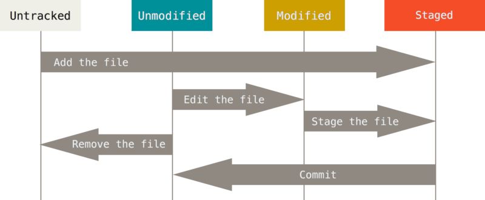
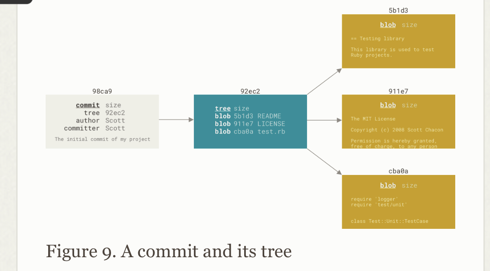
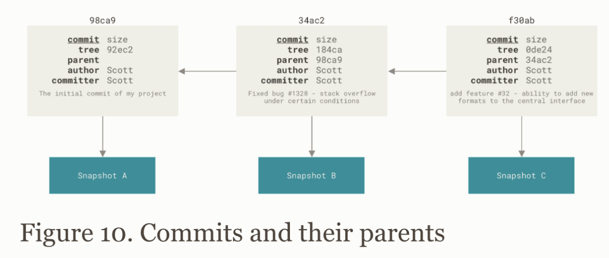
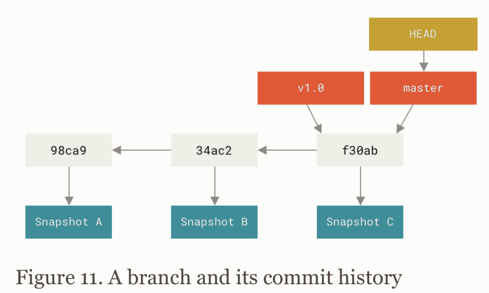
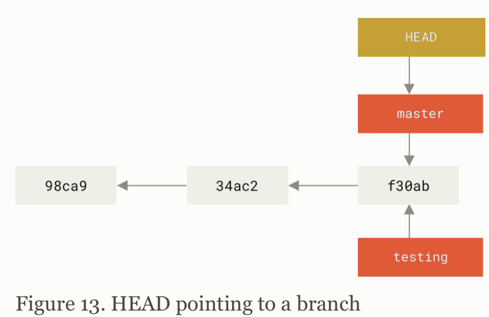
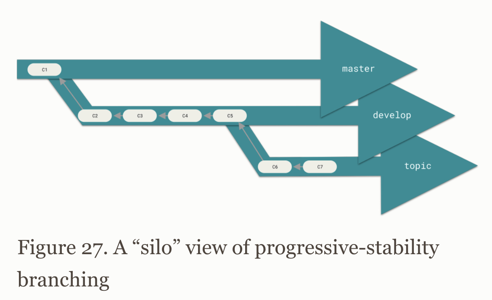
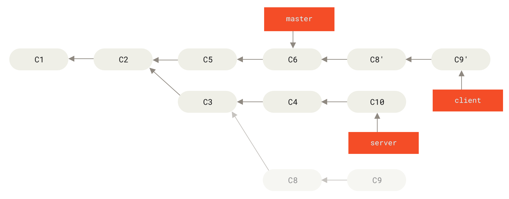

# Git

## Начальная настройка Git

* git help - справка по всем командам
* git init – инициализирует git-проект
* git config --global init.defaultBranch <name>
--global – отвечает за конфиги в ~/.gitconfig
--system - отвечает за конфиги в /etc/gitconfig
--local – отвечает за конфиги в .git/config

## Жизненный цикл статусов в Git

## git log

* git log -p -2 : shows diffs that contains in last 2 commits
* git log —stat : shows u short statistic about last commits
* git log —oneline : shows u info about commits in one line style
* git log —graph —oneline : shows u info about commits with manipulation between branches
* git log — path/to/file : shows u commits based on changes of passed file
* git log —decorate : shows u branch pointers
* git log <branch_name> : shows commits in specified branch
* git log —all : shows commits in all branches

## Work with remote

git remote -v : shows u all info about remotes
git remote add <shortname> <url> : add new remote
git remote show <remote_name> : shows all remote refs (branches, tags…)

git fetch <shortname> : update remote tracking branches
git fetch —all : update remote data from all remotes

git pull <shortname> : fetch data from repo and tryin to merge it with current branch

git remote rename <old name> <new name> : rename remote repo

## Work with tags

git tag : shows list of tag
Annotated tag - full object with name, tagger name and tagger email
Lightweight tag - pointer to commit

git tag -a <tag_name> -m <tag_message> <tag_commit> : create annotated tag
git tag <tag_name> : create lightweight tag

git show <tag_name> : show specified tag
git push <remote> <tag_name> : push tag into remote repo
git push <remote> —tags : push all tags into remote
git tag -d <tag_name> : delete tag from local repo
git push origin —delete <tag_name> : delete tag from remote repo
git push <remote_shortname> <local_branch>:<remote_branch> : push commits into remote branch from local branch

## Work with branches

Blob - representing the content in file
Tree - representing list of blobs
Commit - pointer on root tree and contains metadata

Branch - pointer on commit in chain

HEAD - pointer on current branch

git branch <branch_name> : creates new pointer on commit
git branch -vv : shows branches detail info
git branch -u <remote_shortname>/<branch> : set new tracked branch from remote to current branch

Tracking branch - local branch that has a ref on remote branch ( it let u pull diffs from remote branch into urs)
Upstream branch - remote branch that tracked

git checkout <branch_name> : switch on branch (move HEAD pointer on other branch)
git checkout -b <branch_name> : create new branch and switch on it
git checkout -b <local_branch> <remote>/<remote_branch> : create tracking branch for remote branch with custom name 
git checkout —track <remote>/<branch> : create tracking branch for remote branch

git switch <branch_name> : switch on branch
git switch -c <branch_name> : create new branch and switch on it
git switch : switch on previous branch

git branch —merged <branch_name> : shows branches that merged in specified branch
git branch —no-merged <branch_name> : shows branches ghat not merged in specified branch

Deleting branches
git branch -d <merged_branch_name> : delete merged local branch name
git branch -D <branch_name> : delete local branch name
git push origin —delete <branch_name> : delete remote branch

Renaming branches
git branch —move <old_name> <new_name> : rename local branch
git push —set-upstream origin <new_branch_name> : create new remote branch and set it bind it to current 

## Merge branches

Merge by fast-forward: git merge <branch_name> : merge specified branch into current

Merge diverged (three-way merge):
1. git merge <branch_name>
2. Resolve all conflicts
3. git add .
4. git commit

## Branching Workflow
Long-running branches

1. Master - branch with stable releases
2. Develop - branch with stable developing code
3. Topic - branch with new features

## Squash

git rebase -i HEAD~n : squash n last commits
or
git rebase -i <commit_hash> : squash last commits to commit with specified hash
or
git reset —soft <commit_hash> : squash last commits to commit with specified hash
git commit -am ‘<commit_message>’ : commit all diffs into one
then
git push - f : force push into remote branch (rewriting history)

## Rebase

Rebase will abandon ur old commits and create new in target branch.

git rebase <branch> : rebase branch into current
git rebase <target_branch> <rebased_branch> : rebase one branch into another
git rebase —onto <target_branch> <intermediate_branch> <rebased_branch> : rebase one branch into another without diffs made in intermediate branch

Rule: Rebase local changes before pushing to clean up your work, but never rebase anything that you’ve pushed somewhere.

Example: git rebase —onto master server client - it will takes C8 and C9 and add it after C6
This basically says, “Take the client branch, figure out the patches since it diverged from the server branch, and replay these patches in the client branch as if it was based directly off the master branch instead.”

