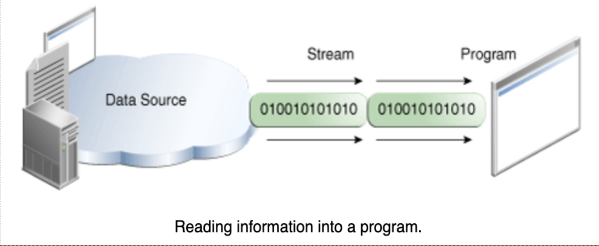
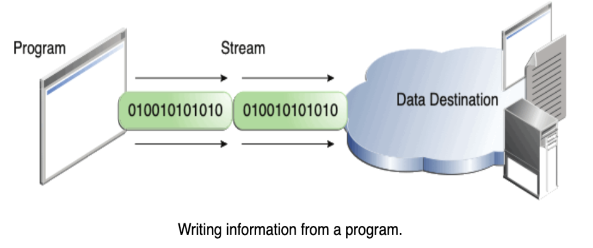
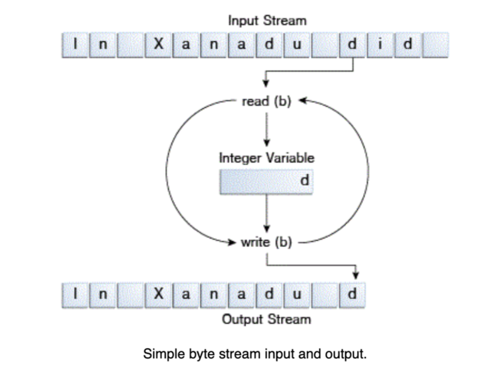
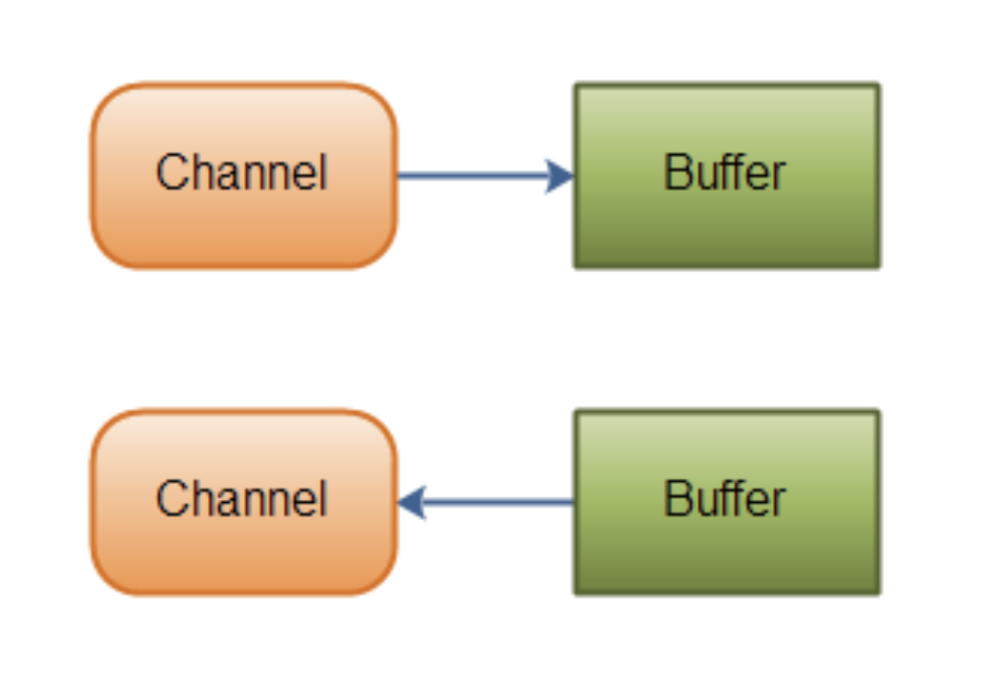
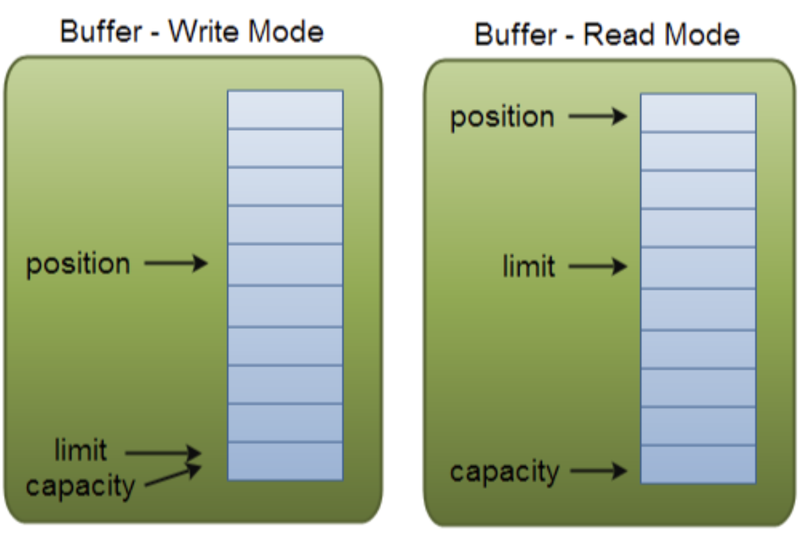
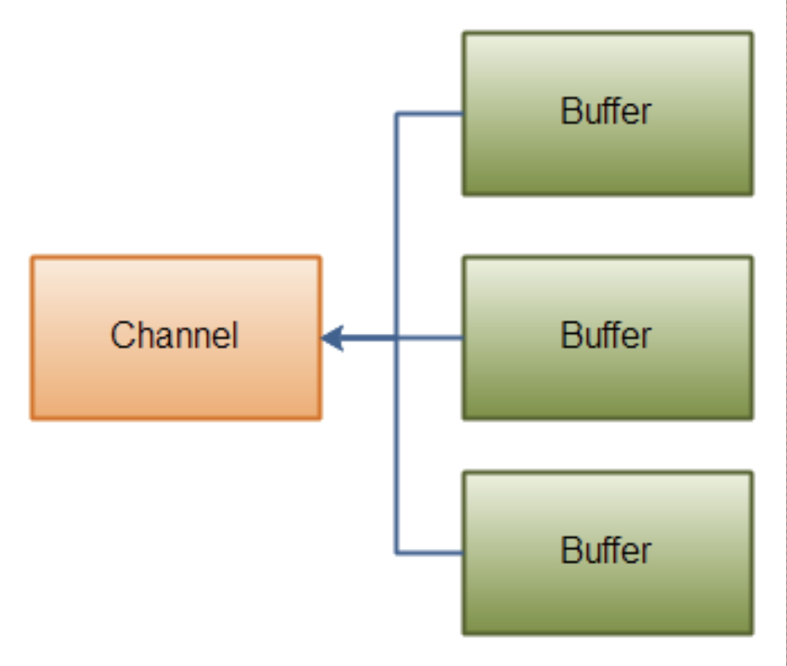
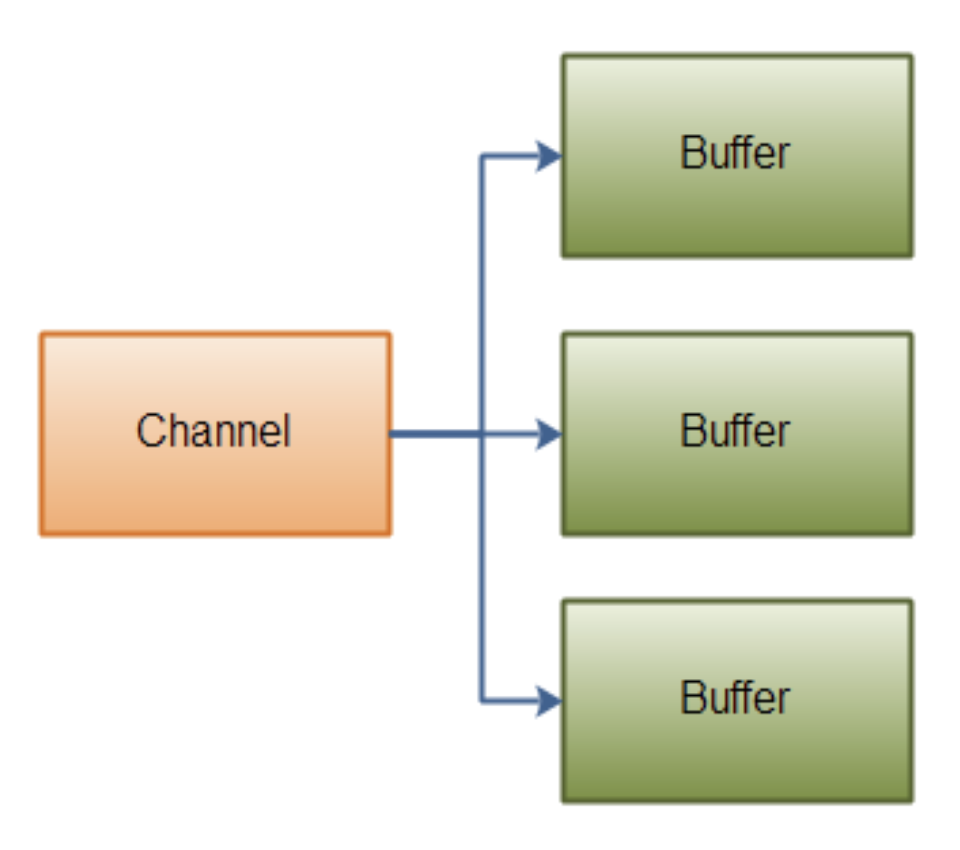

# IO/NIO

## I/O Stream

I/O Stream представляет источник данных или место назначения (файл, другая программа, сокет). Некоторые стримы просто передают дату, некоторые умеют ее преобразовывать. Stream – это последовательность данных. Input stream используется для чтения данных, а output stream для записи данных.




## Стримы байтов

* Все классы стримов байтов происходят от InputStream и OutputStream.
* Все остальные стримы построены на стриме байтов.
* Стримы всегда нужно закрывать, чтобы предотвратить утечку ресурсов.
* Использовать напрямую стримы байтов не рекомендуется.



## Стримы символов

* Стримы символов автоматически адаптируются к локальным символам и готовы к интернационализации. 
* Все классы стримов символов происходят от Reader и Writer
* В стримах символов переменная int содержит значение символа в последних 16 битах, а в стримах байтов переменная int содержит значение байта в последних 8 битах.
* Стримы символов используют стримы байтов. 

## Буферизованные стримы

* Предыдущие стримы были не буферизованными. Это значит что каждое чтение и запись инициирует доступ к диску или сетевую активность, а это очень тяжелые операции.
* Буферизованные стримы читают данные из памяти, называемой буфером. Нативный метод используется только если буфер пуст. С записью то же самое, только буфер должен быть полон.
* Принудительная очистка буфера производится с помощью метода  flush().

Конвертация в буферизированный тип: 
```
new BufferedReader(new FileReader("xanadu.txt")); 
new BufferedWriter(new FileWriter("characteroutput.txt"));
```

## Строко-ориентированное I/O

BufferedReader и PrintWriter позволяют считывать и записывать данные в виде строк.
Символами окончания строки здесь являются \n и \r.

## Scanner и PrintWriter/PrintStream

* Объекты типа Scanner полезны для разбиения форматированного ввода на токены и преобразования отдельных токенов в соответствии с их типом данных.
* Scanner использует whitespace для разделения токенов. (useDelimeter() изменяет разделитель).
* PrintStream и PrintWriter обладают методами print и println, а также format. (System.out = PrintStream).
* В format необходимо использовать %n, так как \n генерирует символ \u000A, который может вызвать проблемы.

## Console

* Console использует стримы символов для чтения и вывода.
* Console имеет возможность скрытно считывать пароль при помощи метода readPassword().
* System.console() – получение экземпляра класса консоли. Может быть null, если нет доступа к консоли.

## Path

Path – програмное представление пути в файловой системе. Path содержит имя файла и список директорий, которые собираются в путь. 

* Для каждой платформы используется свой синтаксис пути.
* Файл для пути может не существовать. Его можно создать и взаимодействовать с ним при помощи класса Files.
* Операции производимые с путем без доступа к файловой системе называются синтаксическими операциями.

## NIO Paths

* get() – достает путь по uri.
* getName() – достает путь, соответствующий индексу [Path хранит имена в виде последовательности].
* getRoot() – возвращает корневую директорию. [Для относительного пути getRoot() == null].
* toUri() – конвертирование пути в строку, открываемую в браузере.
* toAbsolutePath() – возвращает абсолютный путь.
* toRealPath() – возвращает реальный путь файла [разрешает символические ссылки, возвращает абсолютный путь, избавляется от избыточной информации].
* resolve() – соединение двух путей.
* relativize() – создает путь из двух путей [берет первый за основу].

## Try-with-resources

* Большинство ресурсов реализуют интерфейс Closable. Когда ресурс больше не нужен – его нужно освободить методом close().
* try-with-resources – оператор, позволяющий автоматически освобождать ресурс.

## NIO Files

Files – класс, методы которого взаимодействуют с файлами и директориями. Работает с объектами Path.

* exists() – существует ли файл.
* isRegularFile() – обычный ли это файл.
* isReadable() – доступен ли для чтения.
* isExecutable() – доступен ли для запуска.
* isSameFile(Path, Path) – одинаковые ли пути файлов.
* delete() – удаляет файл.
* copy() – копирует файл.
* move() – перемещение файла.

## RandomAccessFile

Позволяет непоследовательный или рандомный доступ к файлу.

* position – Returns the channel's current position
* position(long) – Sets the channel's position
* read(ByteBuffer) – Reads bytes into the buffer from the channel
* write(ByteBuffer) – Writes bytes from the buffer to the channel
* truncate(long) – Truncates the file (or other entity) connected to the channel

## NIO Channel

Канал – это альтернатива стриму. 

* В канал можно писать и читать из него.
* Каналы могут работать асинхронно.
* Каналы работают с буферами.

Реализации:
* FileChannel – для работы с файлами.
* DatagramChannel – для работы через UDP.
* SocketChannel – для работы через TCP.
* ServerSocketChannel – для прослушивания входящего TCP соединения. Каждый раз создается SocketChannel.



## NIO Buffer

Данные из каналов читаются из канала в буфер и наоборот.

Этапы чтения из буфера:
* Запись данных в буфер.
* Переключение в режим чтения (метод flip()).
* Чтение данных из буфера.
* Переключение в режим записи (метод clear() – зачищает буфер, метод compact() – зачищает все прочитанные данные из буфера).

У буфера есть три свойства:

* Capacity - фиксированная вместимость буфера.
* Position - позиция данных в буфере (от 0 до Capacity-1). При чтении позиция обнуляется.
* Limit – при записи limit = capacity. При чтении limit = position.

Типы буферов:
* ByteBuffer
* MappedByteBuffer
* *primitive type*Buffer 



## NIO ByteBuffer

* allocate() – получает объект буфера с указанной вместимостью.
* channel.read() – запись данных в буфер из канала.
* put() – запись данных в буфер напрямую.
* flip() – переключает режим с записи на чтение.
* channel.write() – чтение данных из буфера в канал.
* get() – чтение данных из буфера напрямую.
* rewind() – ставит position = 0 и позволяет перечитать данные.
* clear() – ставит position = 0, а limit = capacity, таким образом переписывая данные.
* compact() – копирует непрочитанные данные в начало буфера и выставляет position = limit, а затем limit = capacity.
* mark() – отмечает position, к которой можно будет вернуться при помощи метода reset()

## NIO Scatter/Gather




Scatter – данные из одного канала записываются в разные буферы (Плохо работает с сообщениями с динамическим размером).
Gather – данные из разных буфером читаются в один канал (Хорошо работает с сообщениями с динамическим размером).

Пример:
```
ByteBuffer header = ByteBuffer.allocate(128);
ByteBuffer body = ByteBuffer.allocate(1024);
ByteBuffer[] byfferArray = { header, body };
channel.write(bufferArray);
channel.read(bufferArray);
```

## NIO Selector

Selector позволяет работать с несколькими каналами в одном потоке.

* open() – создание экземпляра селектора.
* register() – регистрация каналов в селекторе. Канал должен быть неблокирующим. Эвент, на которое канал должен реагировать [Несколько эвентов проставляются через ИЛИ (|)].
* select() blocks until at least one channel is ready for the events you registered for.
* select(long timeout) does the same as select() except it blocks for a maximum of timeout milliseconds (the parameter).
* selectNow() doesn't block at all. It returns immediately with whatever channels are ready
* select отображает готовность новых каналов с последнего вызова select.

## NIO SelectionKey

Здесь содержится список эвентов.

* is*эвент*() – какой эвент ожидается.
* channel()
* selector()
* attach() – присоединяет объект к SelectionKey (Можно привязать Buffer или агрегирующий класс).

## OpenOptions

* WRITE – Opens the file for write access.
* APPEND – Appends the new data to the end of the file. This option is used with the WRITE or CREATE options.
* TRUNCATE_EXISTING – Truncates the file to zero bytes. This option is used with the WRITE option.
* CREATE_NEW – Creates a new file and throws an exception if the file already exists.
* CREATE – Opens the file if it exists or creates a new file if it does not.
* DELETE_ON_CLOSE – Deletes the file when the stream is closed. This option is useful for temporary files.
* SPARSE – Hints that a newly created file will be sparse. This advanced option is honored on some file systems, such as NTFS, where large files with data "gaps" can be stored in a more efficient manner where those empty gaps do not consume disk space.
* SYNC – Keeps the file (both content and metadata) synchronized with the underlying storage device.
* DSYNC – Keeps the file content synchronized with the underlying storage device.
