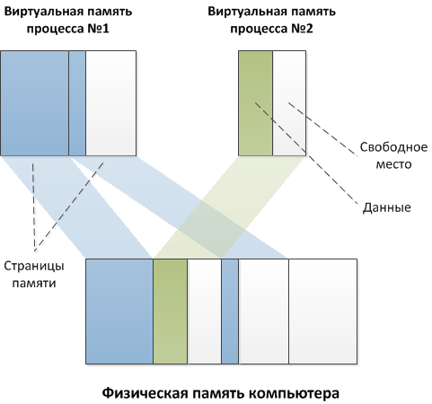
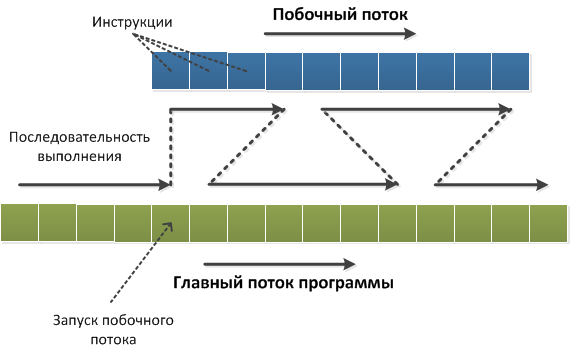
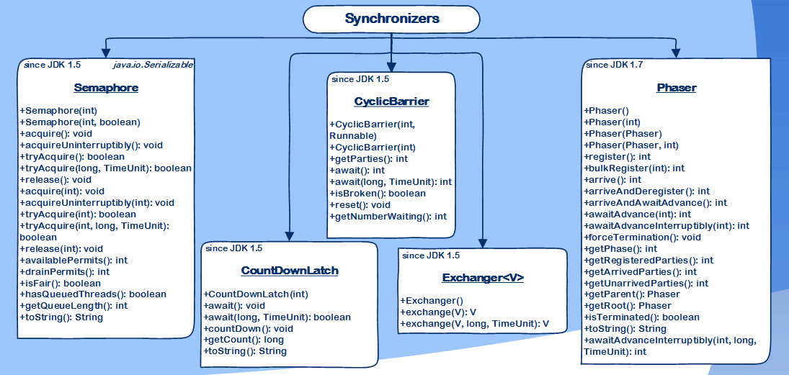
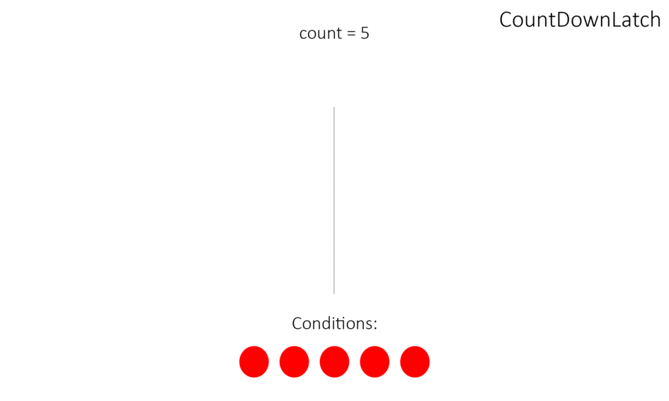
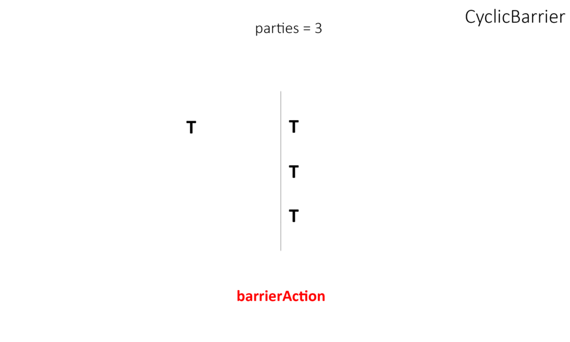

# Многопоточность

Многопоточность в Java — это одновременное выполнение двух или более потоков для максимального использования центрального процессора (CPU — central processing unit).
Каждый поток работает параллельно и не требует отдельной области памяти. К тому же, переключение контекста между потоками занимает меньше времени.

## Процессы

Процесс — это совокупность кода и данных, разделяющих общее виртуальное адресное пространство.
* Процессы изолированы друг от друга, поэтому прямой доступ к памяти чужого процесса невозможен (взаимодействие между процессами осуществляется с помощью специальных средств).
* При запуске программы операционная система создает процесс, загружая в его адресное пространство код и данные программы, а затем запускает главный поток созданного процесса.

## Потоки

Один поток – это единица исполнения кода. Каждый поток последовательно выполняет инструкции процесса, которому он принадлежит.
* Запуск нескольких параллельных потоков возможен и в системах с одноядерными процессорами. Система будет периодически переключаться между потоками, поочередно давая выполняться то одному, то другому потоку. Такая схема называется псевдо-параллелизмом.
* Система запоминает состояние (контекст) каждого потока, перед тем как переключиться на другой поток, и восстанавливает его по возвращению к выполнению потока.

## Создание и запуск потока

1. Через объект класса Thread, в конструктор которого надо передать имплементацию интерфейса Runnable.
2. Через создание потомка класса Thread с переопределением метода run().

## Завершение потока

В Java процесс завершается тогда, когда завершается последний его поток. Для того, чтобы завершить при помощи прерываний можно сделать это.

* interrupt() - прерывание выполнения потока.
* interrupted() - возвращает прерван ли поток.

## Потоки-демоны

Если завершился последний обычный поток процесса, и остались только потоки-демоны, то они будут принудительно завершены и выполнение процесса закончится. Чаще всего потоки-демоны используются для выполнения фоновых задач, обслуживающих процесс в течение его жизни.

* setDaemon() - объявление потока демоном.
* isDaemon() - возвращает является ли поток демоном

## Приоритеты потоков

Каждый поток в системе имеет свой приоритет. Приоритет – это некоторое число в объекте потока, более высокое значение которого означает больший приоритет.

* setPriority() – устанавливает приоритет потока. Возможные значения: MIN_PRIORITY, NORM_PRIORITY и MAX_PRIORITY.
* getPriority() - возвращает приоритет.

## Прочие методы класса Thread

* join() – ожидание окончания выполнения потока.
* isAlive() – проверка работоспособности потока.
* sleep() - пауза в выполнении потока.
* yield() – переключает процессор на обработку других потоков.
* setName()/getName() - работа с именами потока.
* getId() – возвращает id потока.
* currentThread() – возвращает текущий поток.

## Синхронизация потоков

Если несколько потоков одновременно обратятся к общему ресурсу, то результаты выполнения программы могут быть неожиданными. 
* Одним из способов синхронизации является использование ключевого слова synchronized. Его можно применять к блоку кода или методу.
* Монитор - это специальный объект, который следит за "состоянием" метода или объекта. Он смотрит, "занят" он или "свободен" в данный момент.
* Многие проблемы с потоками возникают тогда, когда два потока, используя один метод, мешают друг другу. Они могут менять значения переменных, которые использует другой поток.

## Взаимодействие потоков

* wait() - освобождает монитор и переводит вызывающий поток в состояние ожидания до тех пор, пока другой поток не вызовет метод notify().
* notify() - продолжает работу потока, у которого ранее был вызван метод wait().
* notifyAll() - возобновляет работу всех потоков, у которых ранее был вызван метод wait().

Все эти методы вызываются только из синхронизированного контекста.

## Semaphore

Семафоры представляют еще одно средство синхронизации для доступа к ресурсу. В Java семафоры представлены классом Semaphore, который располагается в пакете java.util.concurrent.

* Для получения разрешения у семафора надо вызвать метод acquire().
* После окончания работы с ресурсом полученное ранее разрешение надо освободить с помощью метода release().

## CountDownLatch

CountDownLatch предоставляет возможность любому количеству потоков в блоке кода ожидать до тех пор, пока не завершится определенное количество операций, выполняющихся в других потоках, перед тем как они продолжат свою деятельность.

* Управление счетчиком производится через метод countDown().
* await() – блокирует поток пока счетчик не будет равен 0.
* Когда счётчик достигает 0, все ожидающие потоки разблокируются и продолжают выполняться.

## Exchanger

Exchanger может понадобиться, для того, чтобы обменяться данными между двумя потоками в определенной точки работы обоих потоков.
* Для обмена данными между двумя потоками используется метод exchange(). Он блокирует поток до вызова того же метода в другом потоке.

## CyclicBarrier

CyclicBarrier – синхронизатор, позволяющий тредам ждать друг друга для дальнейшего выполнения общего кода.
* CyclicBarrier можно переиспользовать.

