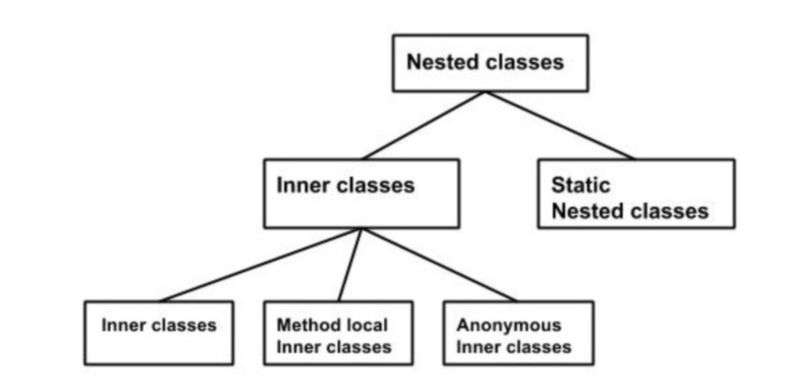

# ООП

## Модификаторы

У полей, классов и методов и т.д. можно указать модификаторы для накладывания на них определенных свойств:

Access Modifiers: 
* public – видны везде
* protected – видны в пакете и у наследников
* private – видны только в классе
* package (пустота) – видны в пакете

Non-access Modifiers:
* static – метод или поле класса, которое существует в одном экземпляре
* final – не дает изменять переменные или наследовать методы и классы
* abstract – метод или класс, который необходимо реализовать
* synchronized – синхронизирует метод или блок кода

## Классы

Класс – шаблон, по которому создаются объекты.
В файле может быть только один публичный класс и несколько непубличных.
Ключевое слово this позволяет обратиться к текущему экземпляру класса.

Виды классов:
* Внутренние классы
* Абстрактные классы
* Интерфейсы

## Nested и Inner классы

## Inner класс

Inner класс – механизм защиты в Java. Такой класс можно пометить модификатором private.

* Чтобы создать экземпляр внутреннего класса, сначала вы должны создать экземпляр внешнего класса. Внутренний класс создается следующим образом: Outer_Demo.Inner_Demo inner = outer.new Inner_Demo().
* Внутренний класс можно разместить внутри метода, но он будет доступен только внутри него.
* Анонимные внутренние классы - внутренние классы у которых нет имени.

## Методы

Методы - это набор операторов, собранных для выполнения определенной логики. 

* Синтаксис метода: modifier returnType methodName (Type typeName) { // method body }
* Синтаксис вызова метода: class.methodName(typeName)
* Для того чтобы метод ничего не вернул returnType должен быть void. 

## Конструкторы

Конструктор – это способ создать экземпляр класса. У каждого класса есть конструктор. 

* В конструкторе обычно указывается логика инициализации полей.
* Если мы явно не задаем конструктор, то создаться дефолтный (не имеющий переменных в сигнатуре).
* У конструктора должно быть такое же название как у класса.
* У класса может быть несколько конструкторов.
* Дефолтный конструктор имеет модификатор доступа класса.
* У конструкторов сабкласса должен быть вызван конструктор суперкласса.

## Наследование

Наследование – процесс, где один класс получает свойства другого. Информация становится управляемой в иерархическом порядке.

* Класс-наследник называется subclass-ом, а наследуемый класс – superclass-ом.
* Класс является наследником, когда в его сигнатуре указывается слово extends с родительским классом или implements с интерфейсом.
* При создании subclass-а происходит создание superclass-а (конструктор  superclass-а должен быть вызваны в конструкторах subclass-а).
* Ключевое слово super позволяет обратиться к членам супер класса.
* IS-A Relationship: This object is a type of that object (наследование).
* HAS-A relationship: А certain class HAS-A certain thing (композиция)[реюзабельность].
* instanceof – ключевое слово для определения принадлежности класса к другому классу в качестве наследника.
* В Java нет множественного наследования от классов, но есть множественная реализация интерфейсов.
* Проверяемые исключения в наследниках могут быть либо как superclass-а, либо быть наследниками этого исключения. 
* Переопределенный метод может иметь в качестве возвращаемого типа как тот же класс, так и его наследника.

## Override и Overload методы

Override методы – методы переопределенные в наследниках.
Overload методы – методы с одинаковым названием, но с разными параметрами в сигнатуре.

## Абстракция

В ООП абстракция – процесс сокрытия деталей реализации от пользователя. Иными словами, пользователю доступна информация о том, что объект делает вместо того, как он это делает. 
В Java абстракция добивается при помощи абстрактных классов и интерфейсов.

## Абстрактные классы

Для того, чтобы сделать класс абстрактным – необходимо добавить ключевое слово abstract в модификаторы класса. Абстрактные классы могут содержать абстрактные методы.
Абстрактные методы – это методы, помеченные ключевым словом abstract. У таких методов нет тела и их нужно реализовывать в наследниках. 

Свойства абстрактных классов:
* Он не может быть инстанциирован.
* Для использования абстрактного класса – необходимо использовать наследников его наследников.
* Если вы наследуетесь от абстрактного класса – вы должны реализовать все его абстрактные методы. 

## Интерфейсы

Интерфейс - это набор abstract методов, который наследник должен реализовать.

* Интерфейс также может содержать константы, default методы(можно переопределять), static методы(нельзя переопределить) и nested типы. Тело методов присутствует только у static и default методов.
* Интерфейс нельзя инстанциировать.
* У интерфейсов нет конструкторов.
* Все методы public abstract неявно. 
* Все поля static final.
* Абстрактный класс не обязан реализовывать все методы интерфейса.
* Интерфейс может расширяться через ключевое слово extends(даже от нескольких интерфейсов).
* Tagging интерфейс – интерфейс без методов, который нужен для создания общего родителя для групп интерфейсов.

## Полиморфизм

Полиморфизм – это когда ссылка на superclass используется для ссылки на объект subclass-а.

* В java объект полиморфен, если он проходит IS-A тест для его типа и для Object. 
* Доступ к объекту доступен только через ссылочную переменную, тип которой не может изменяться. 
* Ссылочная переменная может быть переназначена на другой не-final объект. 
* Ссылочная переменная может быть как классом, так и интерфейсом.
* Виртуальные методы – методы subclass-ов, выполняемые через ссылочную переменную superclass-а.

## Инкапсуляция

Инкапсуляция(сокрытие данных) – механизм оборачивания данных и кода, воздействующего на эти данные, как единое целое. В инкапсуляции, переменные скрыты от других классов и может быть доступен только через методы.

Реализация:
* Пометить поля как private.
* Добавить setter-ы и getter-ы.
Таким образом поля классов можно сделать read-only или write-only.

## Пакеты

Packages – это способ разбить классы и интерфейсы на категории. Это упрощает жизнь при написании приложений.

* Пакет – это первое что должно быть прописано в файле, далее идут импорты, а затем уже сам класс.
* Импорты и пакет распространяются на весь файл.

import - ключевое слово для импортирования пакетов в класс программы.
* Импортировать можно все классы из пакета.
* Ипортировать можно статические методы и поля (добавлением static после слова import).

## Перечисления (enum)

Перечисления – переменная, которая имеет ограниченное количество предопределенных значений.
Enums могут быть объявлены в их собственном классе. Также в enum-е могут быть определены переменные, методы и конструкторы.
