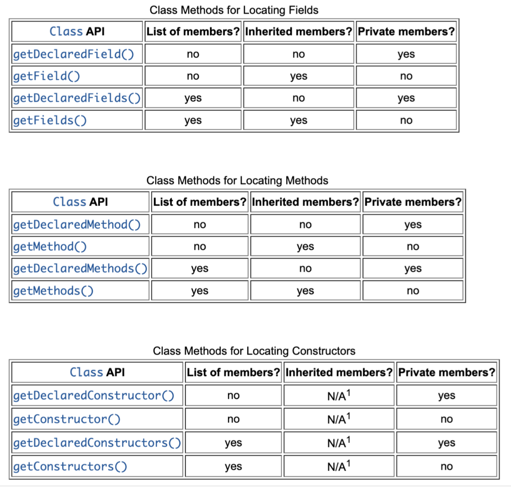

# Reflection API

Рефлексия используется программой, когда требуется возможность просмотра и изменения поведения запущенного приложения.
Рефлексия позволяет выполнять операции, которые базово кодом java не предусмотрены.

## Использование рефлексии

* Приложение может создавать пользовательские классы, инстанциировав их используя полное имя.
* Используется в IDE для перечисления элементов классов во время просмотра классов. 
* IDE могут выиграть от использования информации о типах, доступной при использовании рефлексии, чтобы помочь разработчику написать правильный код.
* Дебагерам необходима возможность просматривать значения приватных полей классов.
* Тестовые инструменты могут использовать рефлексию для вызова API-интерфейсов, определенных в классе, чтобы обеспечить высокий уровень покрытия кода в тестах.

## Недостатки рефлексии

* Код с рефлексией имеет более низкую производительность, так как рефлексия включает типы, которые разрешаются динамически и оптимизации JVM выполнить невозможно.
* Для рефлексии требуются разрешения во время выполнения, которые могут отсутствовать. 
* Использование рефлексии может привести к неожиданным побочным эффектам, так как позволяет выполнять операции, которые были бы недопустимы в нерефлексивном коде (код станет неработоспособным, нарушится портативность или изменит поведение при обновлении платформы).

## java.lang.Class

Для каждого типа объектов JVM инстанциирует неизменяемый экземпляр класса java.lang.Class, который содержит информации о свойствах класса во время выполнения. 
* java.lang.Class дает возможность создавать новые классы и объекты.
* java.lang.Class является входной точкой для всего Reflection API.

Методы класса Class:
* getModifiers() – достает модификаторы. [Modifier.toString()]
* getGenericInterfaces() – достает интерфейсы класса.
* getGenericSuperclass() – достает суперкласс.
* getAnnotations() – достает аннотации.
* getTypeParameters() – достает параметры типа.
* cast() – приводит объект к классу.

## Получение класса объекта

* Если экземпляр объекта доступен, то вызываем Object.getClass(). Это работает только с ссылочными типами.
* Если тип объекта доступен, но экземпляра нет, то есть возможность получить класс добавив .class к имени типа. Так можно получить класс для примитивного типа.
* Если доступно полное имя класса, то есть возможность создать класс при помощи метода Class.forName(). Не работает для примитивов (Синтаксис для имен массивов Class.getName(). Подходит для ссылок и примитивных типов).
* Для каждого примитивного типа и void типа есть обертки, содержащие поле TYPE, равное классу примитивного типа.

Методы, возвращающие класс:
* Class.getSuperclass() – возвращает супер-класс.
* Class.getClasses() – возвращает все public-классы, которые являются его членами.
* Class.getDeclaredClasses() - возвращает все классы, явно объявленные в этом классе.
* Class.getDeclaringClass() – возвращает класс, в котором объявлен этот класс.
* Class.getEnclosingClass() – возвращает класс, охватывающий этот класс.

Методы класса для получения его членов:

## java.lang.reflect.Field

Поле – это класс, интерфейс, массив или enum c соответствующим значением.
Методы класса java.lang.reflect.Field предоставляют динамический доступ и модификацию значений полей.

Методы класса Field:
* getType() – возвращает тип поля.
* getGenericType() – возвращает тип поля с параметризованным типом. [Если дженерика нет – вернет getType()]
* getModifiers() – возвращает модификаторы поля.
* isEnumConstant() – является ли поле enum-костантой.
* isSynthetic() – является ли поле сгенерированным во время выполнения.
* set() – присвоить значение полю. [set*Type*() – для примитивов]
* get() - получить значение поля. [get*Type*() – для примитивов]

## java.lang.reflect.Method

Методы содержат выполняемый код, который может быть вызван.
Класс java.lang.reflect.Method предоставляет API для доступа к модификаторам методов, возвращаемому значению, параметрам, аннотациям и бросаемым исключениям. Также можно вызвать эти методы.

Методы класса Method:
* toGenericString() – возвращает сигнатуру метода в виде строки с параметризованным типом.
* getReturnType() – возвращает возвращаемый тип метода.
* getParameterTypes() – возвращает параметры метода.
* getExceptionTypes() – возвращает исключения, бросаемые методом.
* isVarArgs() – возвращает true, если метод содержит переменное число аргументов.
* invoke() – вызов метода.

## java.lang.reflect.Constructor

Конструкторы используются для создания инстансов класса. Там выполняется инициализация, необходимая перед вызовом методов или получением доступов к полям.
Конструкторы не наследуются.

Методы класса Constructor:
* Методы схожи с методами класса java.lang.reflect.Method
* newInstance() – создает новый экземпляр класса.
* getAnnotatedReturnType() – возвращает аннотированный тип (только для TYPE_USE аннотаций)
* getAnnotatedReceiverType() – возвращает аннотированный тип (только для TYPE_USE аннотаций)
* setAccessible() – изменяет доступность конструктора
