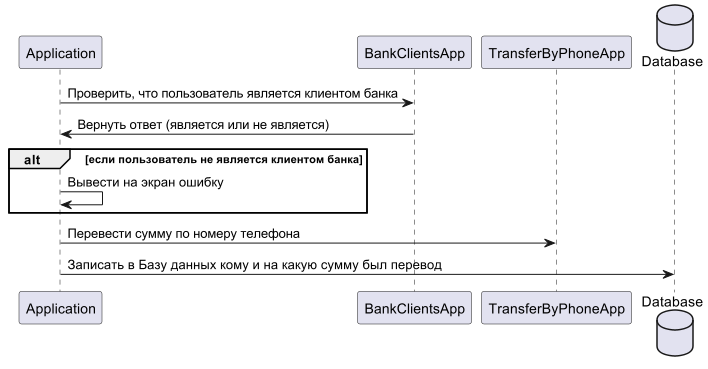

# Контекст Spring

- [Презентация 1](https://docs.google.com/presentation/d/1prFZVgy6VlQ1dXxjs_601HX5vQ0QV6AzAxMb-8B6Y9I/edit?usp=sharing)
- [Презентация 2](https://docs.google.com/presentation/d/1ESgxmzR_KWfkr69wVps1rfwtfE-8FItVatsRALZTCP8/edit?usp=sharing)

## Домашнее задание

##### Задание 1

Создайте 4 класса:

- Попугай
- Кот
- Собака
- Человек

У человека должно быть 2 попугая, 1 кот и 1 собака.

Все объекты должны быть в Spring контексте.

Создайте 2 проекта с разными способами добавления объектов в Spring-контекст

- Через Java-конфигурацию (аннотация `@Bean`)
- Через стереотипные аннотации (аннотация `@Component`)

##### Задание 2

Создать проект, описанный в диаграмме.

- App - ваше приложение.
- BankClientsApp - стороннее приложение. Предоставляет информацию о клиентах банка.
- TransferByPhoneApp - стороннее приложение. Переводит денежные средства по номеру телефона
- DataBase - База данных вашего приложения. Хранит историю переводов.

BankClientsApp, TransferByPhoneApp и DataBase - это заглушки. Их не надо реализовывать.