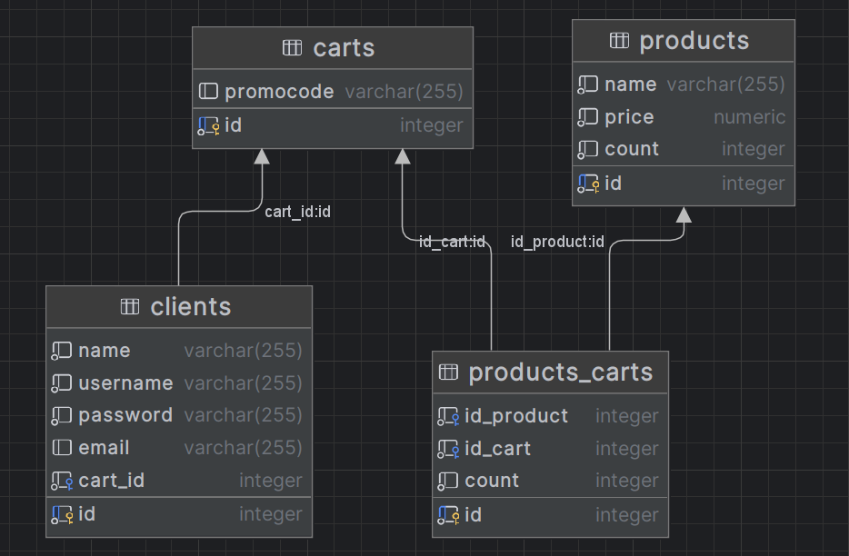

# JDBC

## Домашнее задание

1. Установить Базу Данных h2.
2. Создать таблицы в БД. Используйте готовые [SQL-скрипты](data.sql).

3. Модернизируйте задание по теме [rest](../rest/index.md). Продукты, клиенты и корзины теперь должны храниться в БД.
